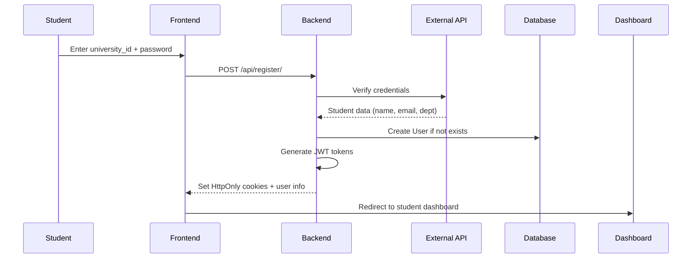

# Authentication & User Management System

## 📋 Overview

The SPU Student Portal implements a secure JWT-based authentication system with role-based access control. The system supports multiple authentication methods and enforces security best practices including HttpOnly cookies, token blacklisting, and password policies.

## 🔐 Authentication Methods

### 1. **Admin/Staff Login** (Manual Account Creation)
- Admins, HoDs, and Doctors use credentials created by the Dean
- Passwords hashed using Django's PBKDF2 algorithm
- First-time users forced to change password

### 2. **Student Self-Registration**
- Students register using university ID + credentials
- System validates against external university API
- Auto-creates local account upon successful validation
- Prevents duplicate registrations

## 👤 User Model

### Base Fields (extends AbstractUser)
```python
class User(AbstractUser):
    role = CharField  # dean, hod, doctor, student
    department = CharField  # software_engineering, ai, security, etc.
    must_change_password = BooleanField
```

### Role Hierarchy
1. **Dean**: Superuser with full system access
2. **HoD**: Department head with management capabilities
3. **Doctor**: Faculty member who supervises projects
4. **Student**: End-user who creates/joins projects

### Constraints
- **Unique HoD per Department**: Only one HoD allowed per department at a time
- **Role Auto-Assignment**: Superusers automatically become Dean
- **Department Required**: For HoD, Doctor, and Student roles

## 🔑 JWT Token Implementation

### Token Configuration
```python
SIMPLE_JWT = {
    'ACCESS_TOKEN_LIFETIME': 30 minutes,
    'REFRESH_TOKEN_LIFETIME': 1 day,
    'ROTATE_REFRESH_TOKENS': True,
    'BLACKLIST_AFTER_ROTATION': True,
}
```

### Token Storage
- **Access Token**: HttpOnly cookie (30 min lifetime)
- **Refresh Token**: HttpOnly cookie (1 day lifetime)
- **Cookie Attributes**:
  - `httponly=True`: Prevents JavaScript access
  - `secure=True` (production): HTTPS only
  - `samesite=Lax`: CSRF protection

### Token Claims
```javascript
{
  "user_id": 123,
  "username": "student001",
  "role": "student",
  "department": "software_engineering",
  "must_change_password": false,
  "exp": 1719176400,  // Expiration timestamp
  "iat": 1719174600   // Issued at timestamp
}
```

## 🔄 Authentication Flows

### Flow 1: Student Self-Registration



**Endpoint**: `POST /api/register/`

**Request**:
```json
{
  "university_id": "201812345",
  "password": "student_password"
}
```

**Response** (Success):
```json
{
  "message": "Welcome, John Doe.",
  "username": "201812345",
  "role": "student",
  "must_change_password": false,
  "department": "software_engineering"
}
```

**Cookies Set**:
- `access_token`: JWT (30 min)
- `refresh_token`: JWT (1 day)

### Flow 2: Manual Login (Doctors/HoDs/Dean)

**Endpoint**: `POST /api/login/`

**Request**:
```json
{
  "username": "dr.smith",
  "password": "secure_password"
}
```

**Response**:
```json
{
  "message": "Login successful.",
  "username": "dr.smith",
  "role": "doctor",
  "must_change_password": false,
  "department": "software_engineering"
}
```

### Flow 3: Token Refresh

**Endpoint**: `POST /api/token/refresh/`

**Process**:
1. Frontend sends request with `refresh_token` cookie
2. Backend validates refresh token
3. Backend generates new access token
4. Backend rotates refresh token (invalidates old one)
5. Backend sets new cookies
6. Old refresh token blacklisted

### Flow 4: Logout

**Endpoint**: `POST /api/logout/`

**Process**:
1. Extract refresh token from cookie
2. Add refresh token to blacklist
3. Clear both cookies
4. Return success response

## 🛡️ Security Features

### 1. **Password Requirements**
- Minimum 8 characters (Django default)
- Cannot be too similar to username
- Cannot be entirely numeric
- Cannot be a common password

### 2. **Rate Limiting**
```python
THROTTLE_RATES = {
    'accounts_login': '10/minute',
    'accounts_register': '5/minute',
}
```

### 3. **Token Blacklisting**
- Uses `rest_framework_simplejwt.token_blacklist`
- Blacklisted tokens stored in database
- Prevents token reuse after logout
- Auto-cleanup of expired blacklisted tokens

### 4. **CORS Configuration**
```python
CORS_ALLOW_CREDENTIALS = True
CORS_ALLOWED_ORIGINS = [
    'http://localhost:3000',
    'http://localhost:5173',
    # Production origins from env
]
```

### 5. **Middleware Chain**
1. `CorsMiddleware`: Handle CORS headers
2. `SessionMiddleware`: Manage sessions
3. `AuthenticationMiddleware`: Populate request.user
4. `JWTCookieMiddleware`: Extract JWT from cookies

### 6. **JWT Cookie Middleware**
```python
class JWTCookieMiddleware:
    """Extract JWT from HttpOnly cookies and add to Authorization header"""
    
    def __call__(self, request):
        access_token = request.COOKIES.get('access_token')
        if access_token:
            request.META['HTTP_AUTHORIZATION'] = f'Bearer {access_token}'
        return self.get_response(request)
```

## 🔧 User Management (Dean Features)

### 1. Bulk Import Users

**Endpoint**: `POST /api/import-users/`

**Permission**: Dean only

**Process**:
1. Upload Excel file (.xlsx)
2. Parse rows (name, ID, email, department)
3. Create users with username = ID
4. Default password = username (must change on first login)
5. Return list of created users

**Excel Format**:
| Full Name | ID | Email | Department |
|-----------|-----|-------|------------|
| John Doe | 201812345 | john@example.com | software_engineering |

**Validation**:
- Max file size: 10 MB
- Max rows: 5,000
- Supported formats: .xlsx, .xlsm, .xltx, .xltm

### 2. Assign Head of Department

**Endpoint**: `POST /api/assign-hod/`

**Permission**: Dean only

**Request**:
```json
{
  "doctor_id": 42,
  "department": "software_engineering"
}
```

**Business Rules**:
- Only one HoD per department
- Must be an existing doctor
- Previous HoD automatically demoted to doctor role

### 3. List Doctors

**Endpoint**: `GET /api/list-doctors/`

**Permission**: Dean only

**Response**:
```json
[
  {
    "id": 42,
    "username": "dr.smith",
    "full_name": "Dr. John Smith",
    "department": "software_engineering"
  }
]
```

### 4. List Departments with HoDs

**Endpoint**: `GET /api/list-departments/`

**Permission**: Dean only

**Response**:
```json
[
  {
    "key": "software_engineering",
    "label": "Software Engineering",
    "hod": {
      "id": 42,
      "username": "dr.smith",
      "full_name": "Dr. John Smith"
    }
  }
]
```

## 🔄 Password Management

### Change Password (Authenticated Users)

**Endpoint**: `POST /api/change-password/`

**Permission**: Authenticated

**Request**:
```json
{
  "new_password": "new_secure_password",
  "confirm_password": "new_secure_password"
}
```

**Validation**:
- Both fields required
- Passwords must match
- Must pass Django password validators
- Clears `must_change_password` flag

## 📡 API Integration Points

### Authentication Headers

**For Cookie-Based Auth** (Recommended):
```http
GET /api/some-endpoint/
Cookie: access_token=<jwt>; refresh_token=<jwt>
```

**For Header-Based Auth** (Alternative):
```http
GET /api/some-endpoint/
Authorization: Bearer <access_token>
```

### Frontend Integration Example

```javascript
// api.jsx configuration
import axios from 'axios';

const api = axios.create({
  baseURL: 'http://localhost:8000',
  withCredentials: true,  // Send cookies
});

// Interceptor for token refresh
api.interceptors.response.use(
  response => response,
  async error => {
    if (error.response?.status === 401) {
      try {
        await api.post('/api/token/refresh/');
        return api.request(error.config);
      } catch (refreshError) {
        // Redirect to login
        window.location.href = '/login';
      }
    }
    return Promise.reject(error);
  }
);
```

## 🐛 Troubleshooting

### Issue: "Token has been blacklisted"
**Cause**: Using a refresh token after logout or after it's been rotated  
**Solution**: Clear cookies and login again

### Issue: "CORS policy error"
**Cause**: Frontend origin not in CORS_ALLOWED_ORIGINS  
**Solution**: Add origin to environment variable

### Issue: "Authentication credentials were not provided"
**Cause**: Missing or expired access token  
**Solution**: Refresh token or re-authenticate

### Issue: "Invalid token" / "Token signature verification failed"
**Cause**: SECRET_KEY changed or token tampered  
**Solution**: Clear all tokens and re-authenticate

## 🔍 Code References

### Key Files
- **Models**: `backend/accounts/models.py`
- **Views**: `backend/accounts/views.py`, `token_views.py`
- **Serializers**: `backend/accounts/serializers.py`
- **Services**: `backend/accounts/services.py`
- **Selectors**: `backend/accounts/selectors.py`
- **Middleware**: `backend/accounts/middleware.py`
- **Permissions**: `backend/accounts/permissions.py`
- **Throttles**: `backend/accounts/throttles.py`

### Service Functions
```python
# services.py
create_user_from_import(username, email, role, password, department)
change_user_password(user, new_password)
assign_hod(doctor_id, department)
lookup_student_in_reference(university_id, password)
register_verified_student(university_id, ref_data)
```

---

**Related Documentation**:
- [API Reference](08-API-REFERENCE.md) - Complete endpoint documentation
- [Security Guidelines](10-SECURITY.md) - Security best practices
- [Frontend Integration](11-FRONTEND-GUIDE.md) - React component examples

**Last Updated**: June 22, 2026
